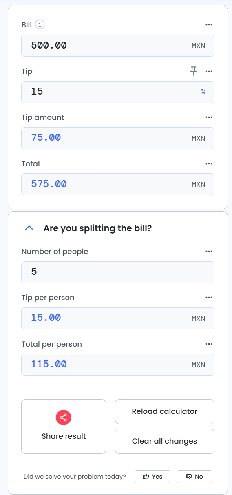

# Reto No. 1 Calculadora de propinas (Tip Calculator)
- **Objetivo:** Practicar la manipulación de números y la creación de funciones.
- **Descripción:** Crea una función llamada `calcularPropina` que reciba dos argumentos: `totalCuenta` (un número) y `porcentajePropina` (un número). La función debe devolver el valor de la propina y, opcionalmente, el total final.
- **Ejemplo:
    ```js

    calcularPropina(100, 15); // Debe retornar 15 (la propina)

    calcularPropina(50, 20); // Debe retornar 10

    ```

##  Functions
### **Fase 1: Funcionalidad e Integridad (MVP)**
El objetivo principal es que la calculadora realice el cálculo de manera correcta y confiable.
- [ ] **Lógica de cálculo**: Crea una función llamada `calcularPropina()` que tome como entrada el total de la cuenta y el porcentaje de propina. Debe devolver la cantidad de propina y el total final.
- [ ] **Entradas del usuario**: Construye una interfaz HTML con dos campos de entrada: uno para el total de la cuenta y otro para el porcentaje de la propina.
- [ ] **Proceso de cálculo**: Agrega un botón "Calcular" que, al ser presionado, ejecute la función `calcularPropina()` con los valores de los campos de entrada.
- [ ] **Mostrar el resultado**: Asegúrate de que la aplicación muestre claramente la cantidad de propina y el total final en la interfaz.
---
### **Fase 2: Mejora de la Experiencia (UX) y Diseño (UI)**
Una vez que la calculadora funcione perfectamente, puedes enfocarte en mejorar su apariencia y facilidad de uso.
- [ ] **Diseño visual**: Aplica estilos CSS para que la calculadora tenga un diseño limpio y moderno (colores, tipografía y espaciado).
- [ ] **Validación de entrada**: Implementa una validación simple para asegurarte de que los valores de entrada sean números y no texto.
- [ ] **Interactividad**: Agrega un control deslizante (`slider`) para el porcentaje de la propina, así el usuario puede ajustarlo de manera más intuitiva.
- [ ] **Casos de uso avanzados**: Añade una opción para dividir la cuenta entre varias personas y calcular la cantidad por persona.
- [ ] **Mejoras visuales**: Considera añadir íconos o animaciones sutiles que mejoren la experiencia del usuario.

## MoSCoW
### **M - Must have (Obligatorio para la primera fase)**
Estos son los requisitos que has logrado o que son cruciales para el funcionamiento básico del producto.
- **Validación del formulario:** La aplicación debe validar en tiempo real que la contraseña cumpla con todas las reglas predefinidas (longitud, mayúsculas, números).
- **Feedback visual:** Debe proporcionar una retroalimentación clara e inmediata (validación exitosa o error) al usuario a medida que escribe en el campo de la contraseña.
- **Cambio de idioma:** La aplicación debe ser capaz de cambiar su interfaz completa entre al menos dos idiomas (español e inglés).
- **Funcionalidad del botón:** El botón de "Iniciar sesión" debe procesar el formulario, ejecutar una validación final y mostrar el resultado.
- **Código modular y escalable:** La estructura del código debe estar organizada en archivos separados (`.js`), utilizando módulos, para permitir una fácil adición de nuevas reglas de validación o idiomas en el futuro.
---
### **S - Should have (Importante, pero puede esperar)**
Estas son las características que mejorarán la integridad y funcionalidad, pero que no son un bloqueo para el lanzamiento.
- **Más reglas de validación:** Implementar reglas adicionales como la validación de caracteres especiales (p. ej., `!@#$%^&`) y un límite máximo de caracteres para evitar contraseñas demasiado largas.
- **Simulación de API:** Simular un inicio de sesión real usando `async/await` y `fetch` para enviar datos a una URL de prueba. Puedes simular una respuesta de éxito o de error para hacer el sistema más robusto.
- **Manejo de estados de carga:** Durante la simulación del envío de datos, el botón de "Iniciar sesión" debe mostrar un estado de carga (p. ej., cambiando su texto a "Cargando..." o deshabilitándose). Esto mejora la experiencia del usuario y previene envíos múltiples.
---
### **C - Could have (Deseable, para una segunda fase)**
Estos requisitos son de menor prioridad y se pueden posponer sin problema. Aquí es donde el diseño de la interfaz de usuario (UI) entra en juego.
- **Diseño UI avanzado:** Animaciones más fluidas, transiciones, y efectos visuales al interactuar con el formulario. Por ejemplo, una barra de progreso que muestre el nivel de fortaleza de la contraseña.
- **Ajustes de UX:** Implementar validación del nombre de usuario (p. ej., formato de correo electrónico) y agregar un botón de "Recordar contraseña".
- **Mensajes de éxito personalizados:** Mostrar una ventana modal o un mensaje emergente (toast) en lugar de solo texto de éxito.
---
### **W - Won't have (Fuera de alcance)**
Estas son funcionalidades que no se incluirán en el proyecto actual, lo que evita la "expansión del alcance" (scope creep).
- **Conexión a una base de datos real:** No se implementará un sistema de usuarios ni una base de datos para almacenar contraseñas.
- **Autenticación real:** No se integrará con sistemas de inicio de sesión de terceros (p. ej., Google, Facebook).
- **Sistema de recuperación de contraseña:** La función de "Olvidé mi contraseña" no es parte de este proyecto.

##  How to calculate a tip?

Our tip calculator will calculate the **total you need to pay**, including a tip of your choosing. In cases where there are several people paying their own part of a **shared bill**, you can choose the number of people and we will split the bill and tip and present the amount each of you needs to pay.

Most of the time it is convenient for both you and the service personnel to leave a whole banknote and not wait for small change. The gratuitiy calculator supports several ways of **rounding the bill**: to the nearest whole dollar (or euro, etc.), to the nearest 5, 10, or 50 dollars. More than that, when you need to collect a shared bill from multiple people, it is also convenient to round each party's contribution, so we offer rounding for shared bills and tips as well!

This calculator is great for using in a restaurant, pizza place, coffee house, bar or to tip a taxi, a coat checker, a maid, bellman or porter, valet parking, dealers at table games, a masseuse for a massage, and many other businesses. You can see a table of suggested tips per occupation below.

Mathematically, the calculation of a tip is the calculation of a percent of a given base. In this case the presented bill is the base, and the tip is the percent you need to add to it. Note that **the tip calculator will operate with any currency** you provide, and the output will be in the same currency, even if it says "dollar" (&usd;) on the label.

###  Simple tip formula

The formula to add a tip to a given bill is simply _Bill x (100 + %Tip) / 100_. For example, if you want to tip 20% on a $100 restaurant bill after eating a nice meal, then it will be $100 x (100 + 20) / 100 = $100 x 120 / 100 = $120 total bill. This equation is used when you enter "1" for "Number of people" in the shared tip calculator interface.

### Shared tip calculation

For a shared tip, you need to first calculate the simple tip and then divide by the number of people paying the restaurant bill. If 3 people were sharing a bill of $100 and a 20% tip, then that's $120 / 3 = $40 a piece. In case the number is not whole, it is usually convenient to round it up, as our gratuitiy calculator will do for you.

##  How much to tip in different situations?

One of the required input fields in any add tip calculator is the rate or percent to sweeten the bill with. Here are some common situations and the tips appropriate for them, but these are guidelines, not rules. Please, note that these numbers apply mostly to the United States and Canada.

Tips in different situations

| Service type                           | Typical tip       | Remark                                                                                                                                   |
| :------------------------------------- | :---------------- | :--------------------------------------------------------------------------------------------------------------------------------------- |
| Restaurants  (waiters)                 | 15 - 20%          | Many restaurant workers rely primarily on tips for their subsistence. Tipping in fast-food and other self-service places is not typical. |
| Bars  (bartenders)                     | 15 - 20%          | If you tip well, you might actually get one drink on the house ("buyback", "comp").                                                      |
| Food delivery                          | 10 - 20%          | Usually depending on the distance.                                                                                                       |
| Taxis                                  | 10 - 15%          | Based on service.                                                                                                                        |
| Hotel maids / housekeeping             | $2-3 per night    | -                                                                                                                                        |
| Hotel concierge                        | $5 per request    | The more difficult the request, the higher the tip.                                                                                      |
| Room service                           | $1-2 per delivery | Regardless of whether service charge is included.                                                                                        |
| Hotel porter                           | $1-2 per bag      | Maybe more, if the bags are particularly heavy.                                                                                          |
| Mover, Furniture or Appliance delivery | Not expected      | $5-20 each, depending on the amount.                                                                                                     |
| Hairstylists, Nail service             | 10 - 20%          | -                                                                                                                                        |
| SPA, Massage                           | 15 - 20 %         | You may want to ask if the tip is included in the bill.                                                                                  |
| Tour guides                            | $15-20            | Depending on length of tour, knowledge and presentation.                                                                                 |

In some establishments a **mandatory tip** may be added to all bills or to bills for a table where more than a certain number of people are seated, e.g. 6 or more people. In such cases the mandatory tip should be noted in the menu and it should certainly be included in the bill, so watch out so you don't double tip by accident. Obviously, you do not need a calculator in such a situation.


Please, note that in many countries it is explicitly **forbidden to tip government or municipal workers**, for example police officers or clerks. It may be seen as an attempted bribery! Do not use our software for illegal activities.

It is important that you do not feel pressured to leave a generous tip, especially if displeased with the service. A tip is expressing gratitude and so it makes no sense to leave one if you are unhappy with how you were threated. If it is a borderline case, you can opt to leave a small tip - just enter a smaller tip percentage in the simple tip calculator. In really bad cases you might want to skip the tip entirely and ask for the manager instead, however unpleasant that might be.

  

##  Origins and history of tipping

Leaving a tip (also gratuity) most of the time refers to a sum of money given to a service worker, on top of the base price. Tips usually go directly in the pocket of the person being tipped, though there are exceptions - when teams of workers share tips, tips left in common tip jars, as well as cases where tips are taxed by local or state governments. Tips are a matter of social norm and etiquette and so the practice varies greatly from country to country and from situation to situation, which is why it is handy to have a calculator ready. In many countries it is expected to just round up the sum, while in others no tip is expected, or the person may even get offended or insulted if you tip them. In others it can just lead to a small confusion.

There are claims that the word "tip" came from an acronym of one of these: "To Insure Promptness", "To Insure Performance", "To Insure Prompt Service". However, **there is little to no substantiation of these claims** and logically it doesn't make sense, since tips are given after, not before performing the service or duty, so while one can argue about long-term effects, it is highly dubious that an uncertain compensation of an unknown size after an act can stimulate the actor to do anything special or out of the ordinary. Also, no matter what amount of tip you calculate in your bill, it is not ensuring or insuring anything.

From the best available evidence (written language) it seems it was used as both a verb and a noun as early as the 1700s in Britain. There are reasons to believe the word, which then and now stands for sharing both sums of money and intelligence or general information, may have originated from underworld slang. Nowadays, of course, the usage of the word is entirely decent and there is nothing shady about using an online tip calculator.

From Europe, the practice of giving tips spread to different parts of the world, including the United States, probably in the early 1800s. In the late 1800s there was a movement against tipping that claimed it is unamerican and denigrating to the person being tipped. Currently, tipping is widespread in service-oriented industries as it is believed that it better aligns the interest of owner, worker and client, and encourages better service in the long run, though this claim is debated in literature.

##  What tip calculator to use?

Nowadays there are **many different software vendors** offering various calculators. A simple way is to employ Microsoft Excel and calculate the tip in a spreadsheet, using the abovementioned formulas. Provided you have a smartphone, you can use a relevant Andoid or iOS mobile app. Google search nowadays has an in-built calculator as well.

While there are a variety of options availble to you, you should consider using the calculator you find most convenient to use. You will be delighted with the user experience of using our **shared tip calculator** and on top of that it supports shared bill tip calculation and rounding the bill to various whole numbers. Not only does it do the math for you, but it is also easy to use on your phone due to its responsive design. If there is a functionality that would you make you happier in using our tool, just let us know!
  
  
  
### Inspiration - Design Ideas



 How to calculate a tip?